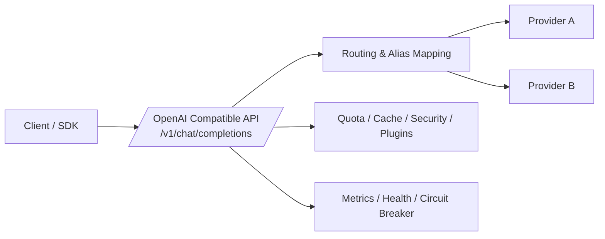

# Shortlink AI Gateway

<div align="center">


</div>

一个面向 LLM 接入场景的统一 AI 网关，基于 **Spring Boot 3 + WebFlux** 构建，对外提供 **OpenAI 兼容接口**，对内支持多 Provider 路由、流式透传、配额治理与韧性保护。

---

## 目录

- [项目亮点](#项目亮点)
- [技术栈](#技术栈)
- [架构概览](#架构概览)
- [快速开始](#快速开始)
- [接口示例](#接口示例)
- [配置说明](#配置说明)
- [构建与测试](#构建与测试)
- [可观测性与稳定性](#可观测性与稳定性)
- [工程化能力](#工程化能力)
- [Roadmap](#roadmap)

---

## 项目亮点

| 能力模块 | 说明 |
| --- | --- |
| OpenAI 兼容入口 | 暴露 `/v1/chat/completions`，支持流式（SSE）与非流式 |
| 多 Provider 路由 | Provider 路由、模型别名映射、上游解耦 |
| 韧性治理 | 超时、重试、Fallback、Resilience4j 熔断 |
| 配额体系 | 基于 Redis 的 token quota ledger |
| 缓存策略 | 支持响应缓存 / 语义缓存开关 |
| 安全拦截 | 输入输出安全策略与统一异常返回 |
| 插件化扩展 | 请求前 / 响应后插件链机制 |
| 运行可观测 | 延迟、状态、token 消耗等指标记录 |

---

## 技术栈

- **Language**: Java 17
- **Framework**: Spring Boot 3.3.2, Spring Cloud Gateway, WebFlux
- **Data & Cache**: Redis, R2DBC(MySQL，可选)
- **Test**: JUnit 5, Reactor Test
- **Build**: Maven

---

## 架构概览



核心启动类：`src/main/java/com/nageoffer/shortlink/aigateway/AiGatewayApplication.java`

---

## 快速开始

### 1) 前置依赖

- JDK 17
- Maven（`mvn`）
- Docker（可选，推荐用于启动 Redis）

### 2) 启动 Redis

```bash
docker compose up -d redis
```

### 3) 启动网关（local profile）

```bash
mvn spring-boot:run -Dspring-boot.run.profiles=local
```

默认端口：`8010`

### 4) （可选）启用 MySQL / R2DBC 租户配置

先执行初始化脚本：

```bash
src/main/resources/sql/init_multi_tenant_platform_mysql.sql
```

再配置环境变量：

```bash
AI_GATEWAY_R2DBC_URL=r2dbc:pool:mysql://127.0.0.1:3306/ai_gateway
AI_GATEWAY_DB_USERNAME=root
AI_GATEWAY_DB_PASSWORD=root
AI_GATEWAY_TENANT_DB_ENABLED=true
```

启用后：tenant API Key / model policy / quota policy / model price 优先从 DB 读取，未命中时回退到 `application.yml`。

### 5) 生产部署建议（prod profile）

生产环境建议使用 `prod` profile，并通过环境变量注入敏感配置：

```bash
AI_GATEWAY_JWT_SECRET=***
AI_GATEWAY_ADMIN_PASSWORD=***
AI_GATEWAY_VIEWER_PASSWORD=***
NACOS_SERVER_ADDR=***
```

生产配置文件：`src/main/resources/application-prod.yml`

---

## 接口示例

### 非流式请求

```bash
curl -X POST "http://127.0.0.1:8010/v1/chat/completions" \
  -H "Content-Type: application/json" \
  -H "Authorization: Bearer <your-key>" \
  -d '{
    "model": "gpt-4o-mini-compatible",
    "messages": [{"role": "user", "content": "hello"}],
    "stream": false
  }'
```

### 流式请求（SSE）

```bash
curl -N -X POST "http://127.0.0.1:8010/v1/chat/completions" \
  -H "Content-Type: application/json" \
  -H "Authorization: Bearer <your-key>" \
  -d '{
    "model": "gpt-4o-mini-compatible",
    "messages": [{"role": "user", "content": "hello"}],
    "stream": true
  }'
```

---

## 配置说明

主配置文件：`src/main/resources/application.yml`

推荐通过环境变量覆盖敏感参数：

- `AI_GATEWAY_JWT_SECRET`
- `AI_GATEWAY_ADMIN_PASSWORD`
- `AI_GATEWAY_VIEWER_PASSWORD`
- `REDIS_HOST` / `REDIS_PORT`
- `NACOS_SERVER_ADDR`
- `AI_GATEWAY_R2DBC_URL`
- `AI_GATEWAY_DB_USERNAME`
- `AI_GATEWAY_DB_PASSWORD`
- `AI_GATEWAY_TENANT_DB_ENABLED`

---

## 构建与测试

### 常用命令

```bash
# 编译（不跑测试）
mvn -DskipTests compile

# 运行全部测试
mvn test

# 完整校验（含覆盖率）
mvn clean verify

# 打包
mvn clean package -DskipTests
```

### 运行指定测试

```bash
# 单个测试类
mvn -Dtest=ProviderRoutingServiceTest test

# 单个测试方法
mvn -Dtest=ProviderRoutingServiceTest#shouldResolveAliasProviderAndModel test

# 多个测试类
mvn -Dtest=ProviderRoutingServiceTest,SseStreamE2ETest test
```

JaCoCo 报告：`target/site/jacoco/index.html`

---

## 可观测性与稳定性

- Prometheus 指标：`/actuator/prometheus`
- 健康检查：`/actuator/health`
- 熔断实例：`provider-openai`、`provider-claude`

> 建议在 CI 中配置 `NVD_API_KEY`（GitHub Secrets）以减少 dependency-check 数据更新时间。

---

## 本地“近真实”E2E 模拟

无需真实外部 API，可使用内置脚本验证主流程：

```bash
mvn -DskipTests package
powershell -ExecutionPolicy Bypass -File "scripts/simulate_e2e.ps1"
```

该脚本会自动：

- 启动本地 mock provider（`127.0.0.1:18080`）
- 启动网关（`127.0.0.1:18010`）
- 验证流式与非流式链路

---

## 工程化能力

- CI：`.github/workflows/ci.yml`（`clean verify` + 覆盖率门禁 + 打包上传）
- 安全扫描：OWASP Dependency-Check（支持 `NVD_API_KEY`）
- 协作规范：`AGENTS.md`
- API 清单：`docs/api-inventory.md`

---

## Roadmap

- [ ] 增加 Testcontainers 集成测试（Redis）
- [ ] 补充 Prometheus + Grafana 可视化面板
- [ ] 增加真实上游 smoke test（受控 key / 限额）
- [ ] 输出性能基线（P95、错误率、吞吐）
